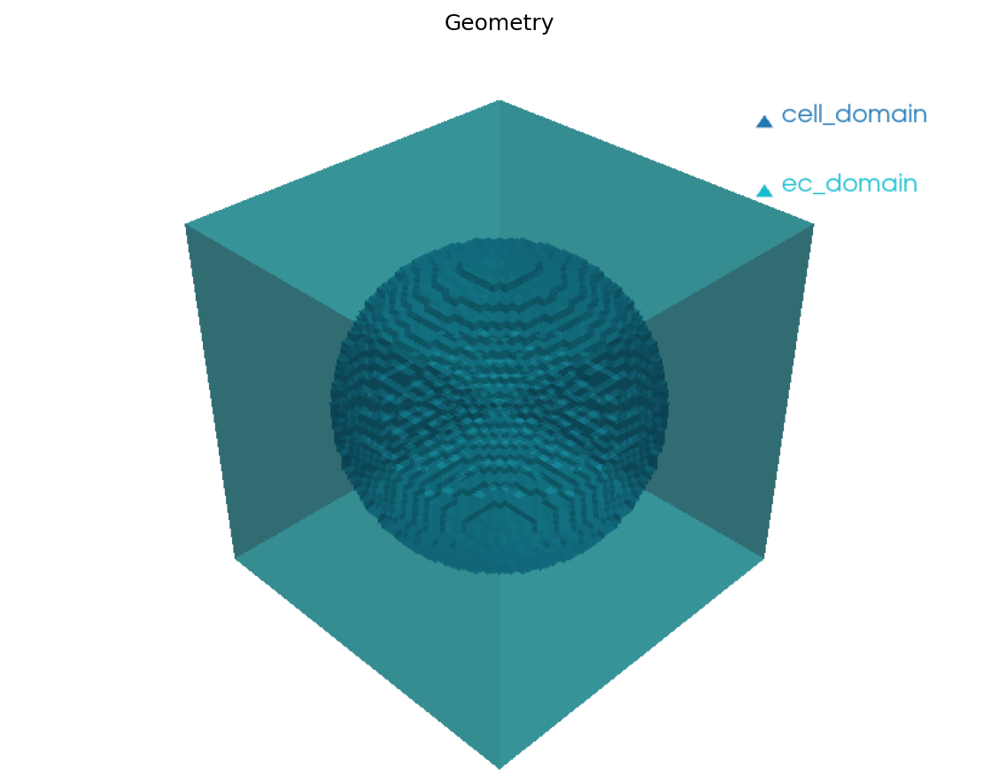
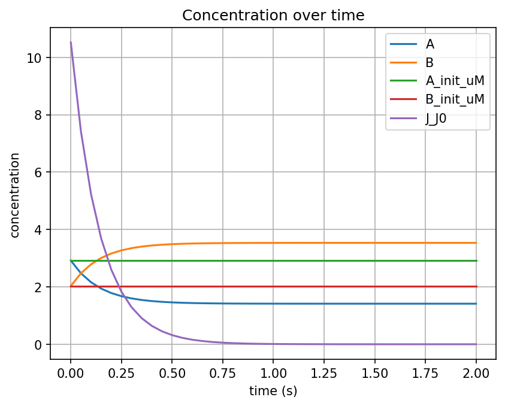
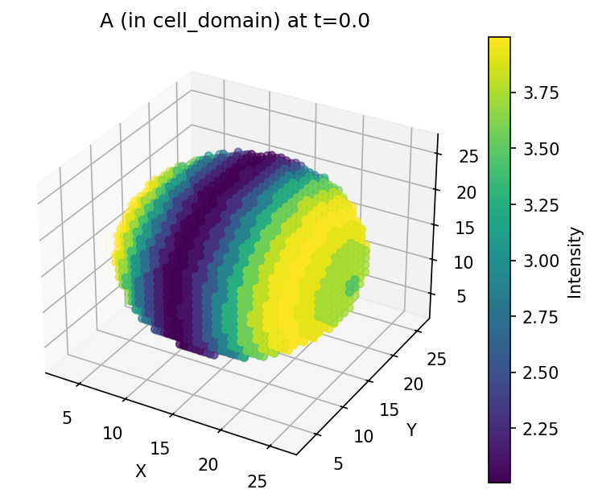

# Building a Model

This guide shows how to define a reaction network using Antimony, create a 3D geometry, set up an application, and run a spatial simulation.

## Prerequisites

- pyvcell installed (`pip install pyvcell`)

## Define a reaction network with Antimony

[Antimony](https://tellurium.readthedocs.io/en/latest/antimony.html) is a human-readable language for defining biochemical models. pyvcell can load Antimony strings directly:

```python
import pyvcell.vcml as vc

antimony_str = """
    compartment ec = 1;
    compartment cell = 2;
    compartment pm = 1;
    species A in cell;
    species B in cell;
    J0: A -> B; cell * (k1*A - k2*B)
    J0 in cell;

    k1 = 5.0; k2 = 2.0
    A = 10
"""

biomodel = vc.load_antimony_str(antimony_str)
```

## Inspect and correct the model

After import, you may need to adjust compartment dimensions. Membranes should be 2D:

```python
model = biomodel.model
model.get_compartment("pm").dim = 2

print(model)
# Model(compartments=['ec', 'cell', 'pm'], species=['A', 'B'],
#       reactions=['J0'], parameters=['k1', 'k2'])

print(model.parameter_values)
# {'k1': 5.0, 'k2': 2.0}
```

## Create a 3D geometry

Define a geometry with analytic subvolumes. Here we create a sphere inside a box:

```python
geo = vc.Geometry(name="geo", origin=(0, 0, 0), extent=(10, 10, 10), dim=3)
geo.add_sphere(name="cell_domain", radius=4, center=(5, 5, 5))
geo.add_background(name="ec_domain")
geo.add_surface(name="pm_domain", sub_volume_1="cell_domain", sub_volume_2="ec_domain")
```

The order of `add_sphere` / `add_background` matters — subvolumes added first have higher priority. The sphere is carved out of the background.



## Create an application

An application connects the model to the geometry by mapping compartments to geometric domains and species to initial conditions:

```python
app = biomodel.add_application("app1", geometry=geo)

# Map compartments to geometry domains
app.map_compartment("cell", "cell_domain")
app.map_compartment("ec", "ec_domain")

# Map species with initial conditions and diffusion coefficients
app.map_species("A", init_conc="3+sin(x)", diff_coef=1.0)
app.map_species("B", init_conc="2+cos(x+y+z)", diff_coef=1.0)
```

Initial concentrations can be constants (e.g., `10.0`) or spatial expressions using `x`, `y`, `z` coordinates.

## Add a simulation and run

```python
sim = app.add_sim(
    name="sim1",
    duration=2.0,
    output_time_step=0.05,
    mesh_size=(50, 50, 50),
)

results = vc.simulate(biomodel=biomodel, simulation="sim1")
```

## Visualize results

```python
results.plotter.plot_concentrations()
results.plotter.plot_slice_3d(time_index=0, channel_id="A")
results.plotter.plot_slice_3d(time_index=0, channel_id="B")
```





## Complete example

```python
import pyvcell.vcml as vc

# 1. Define reaction network
antimony_str = """
    compartment ec = 1;
    compartment cell = 2;
    compartment pm = 1;
    species A in cell;
    species B in cell;
    J0: A -> B; cell * (k1*A - k2*B)
    J0 in cell;
    k1 = 5.0; k2 = 2.0
    A = 10
"""
biomodel = vc.load_antimony_str(antimony_str)
model = biomodel.model
model.get_compartment("pm").dim = 2

# 2. Create geometry
geo = vc.Geometry(name="geo", origin=(0, 0, 0), extent=(10, 10, 10), dim=3)
geo.add_sphere(name="cell_domain", radius=4, center=(5, 5, 5))
geo.add_background(name="ec_domain")
geo.add_surface(name="pm_domain", sub_volume_1="cell_domain", sub_volume_2="ec_domain")

# 3. Create application
app = biomodel.add_application("app1", geometry=geo)
app.map_compartment("cell", "cell_domain")
app.map_compartment("ec", "ec_domain")
app.map_species("A", init_conc="3+sin(x)", diff_coef=1.0)
app.map_species("B", init_conc="2+cos(x+y+z)", diff_coef=1.0)

# 4. Simulate
sim = app.add_sim(name="sim1", duration=2.0, output_time_step=0.05, mesh_size=(50, 50, 50))
results = vc.simulate(biomodel=biomodel, simulation="sim1")

# 5. Visualize
results.plotter.plot_concentrations()
results.plotter.plot_slice_3d(time_index=0, channel_id="A")
```

!!! tip "Interactive tutorial"
See the [Building a Model tutorial](notebooks/building-a-model.ipynb) for a runnable notebook with visual output, or the [sysbio-1-antimony notebook](https://github.com/virtualcell/pyvcell/blob/main/examples/notebooks/sysbio-1-antimony.ipynb) for the course version.

## Next steps

- [Complex Geometries](complex-geometries.md) — Multi-compartment and reusable geometries
- [Parameter Exploration](parameter-exploration.md) — Run batch simulations with varied parameters
- [Visualization & Analysis](visualization.md) — Full plotting and 3D visualization guide
