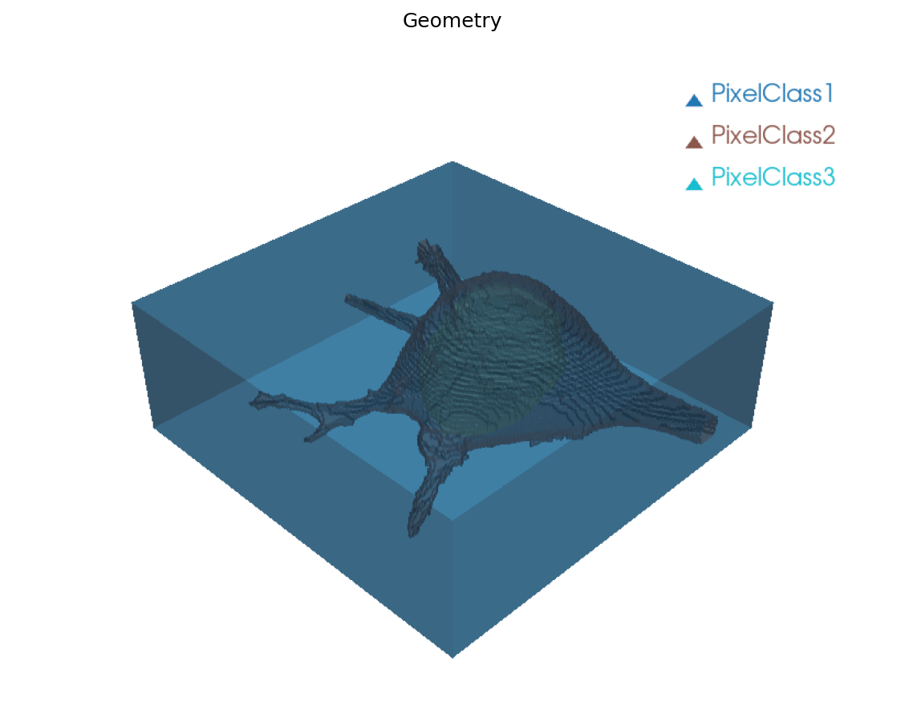
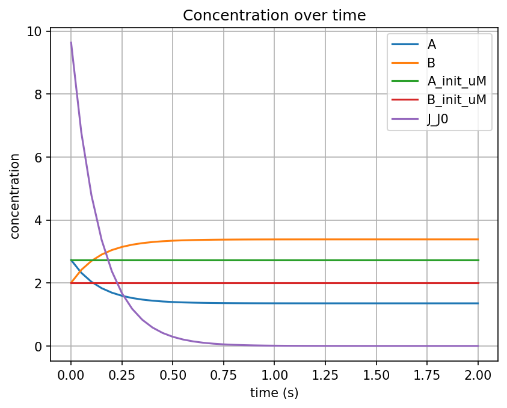
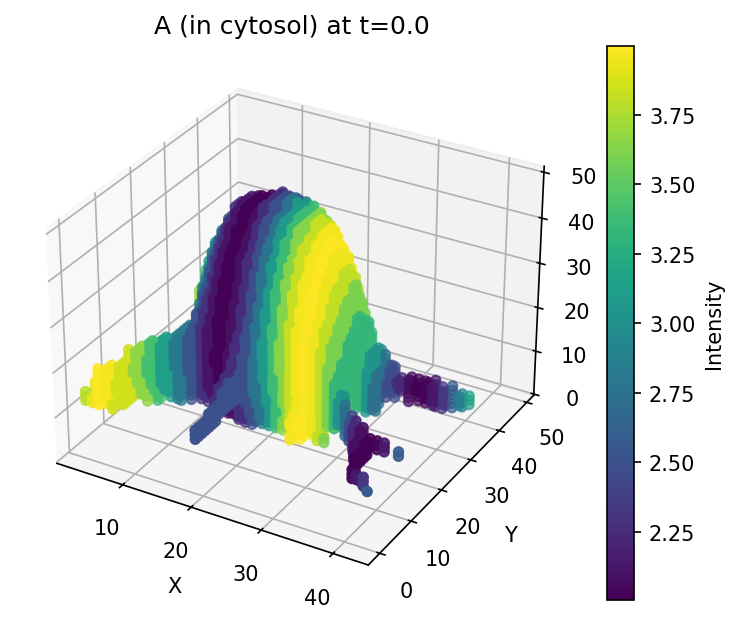

# Complex Geometries

This guide covers multi-compartment geometries, reusing geometries from existing models, and working with image-based geometries.

## Prerequisites

- pyvcell installed (`pip install pyvcell`)
- Familiarity with [Building a Model](building-a-model.md)

## Multi-compartment geometry

For models with multiple nested compartments (e.g., cell with nucleus), define each subvolume and the surfaces between them:

```python
import pyvcell.vcml as vc

antimony_str = """
    compartment ec = 10000;
    compartment cell = 5000;
    compartment pm = 100;
    compartment nuc = 300;
    compartment nuc_env = 40;
    species A in cell;
    species B in cell;
    J0: A -> B; cell * (k1*A - k2*B)
    J0 in cell;
    k1 = 5.0; k2 = 2.0
    A = 10
"""

biomodel = vc.load_antimony_str(antimony_str)
model = biomodel.model

# Set membrane compartments to 2D
model.get_compartment("pm").dim = 2
model.get_compartment("nuc_env").dim = 2
```

## Reuse geometry from an existing model

Instead of building geometry from scratch, you can copy one from another VCML model. This is useful for complex image-based or multi-compartment geometries:

```python
# Load a model with a pre-built geometry
tutorial_biomodel = vc.load_vcml_url(
    "https://raw.githubusercontent.com/virtualcell/pyvcell/refs/heads/main/"
    "examples/models/Tutorial_MultiApp_PDE.vcml"
)

# Extract the geometry
tutorial_geometry = tutorial_biomodel.applications[0].geometry

# Inspect the geometry structure
print("subvolumes:", tutorial_geometry.subvolume_names)
# ['ec', 'cytosol', 'Nucleus']

print("surfaces:", tutorial_geometry.surface_class_names)
# ['cytosol_ec_membrane', 'Nucleus_cytosol_membrane']
```



## Map compartments to the imported geometry

When using an existing geometry, map each model compartment to the appropriate geometric domain:

```python
app = biomodel.add_application("app1", geometry=tutorial_geometry)

# Map volume compartments to subvolumes
app.map_compartment("cell", "cytosol")
app.map_compartment("ec", "ec")
app.map_compartment("nuc", "Nucleus")

# Map membrane compartments to surface classes
app.map_compartment("nuc_env", "Nucleus_cytosol_membrane")
app.map_compartment("pm", "cytosol_ec_membrane")

# Set species initial conditions and diffusion
app.map_species("A", init_conc="3+sin(0.2*x)", diff_coef=1.0)
app.map_species("B", init_conc="2+cos(0.2*(x+y+z))", diff_coef=1.0)
```

## Simulate and visualize

```python
sim = app.add_sim(name="sim1", duration=2.0, output_time_step=0.05, mesh_size=(50, 50, 50))

results = vc.simulate(biomodel=biomodel, simulation="sim1")
results.plotter.plot_concentrations()
results.plotter.plot_slice_3d(time_index=0, channel_id="A")
```





## Analytic geometry primitives

You can build geometries from analytic expressions using the built-in helpers:

```python
geo = vc.Geometry(name="geo", origin=(0, 0, 0), extent=(10, 10, 10), dim=3)

# Add a sphere (inner compartment — higher priority)
geo.add_sphere(name="cell_domain", radius=4, center=(5, 5, 5))

# Add background (fills remaining space)
geo.add_background(name="ec_domain")

# Define the surface between them
geo.add_surface(name="pm_domain", sub_volume_1="cell_domain", sub_volume_2="ec_domain")
```


!!! note "Subvolume ordering"
Subvolumes are evaluated in the order they are added. Earlier subvolumes have higher priority — the sphere is carved out of the background.

## Image-based geometry

For geometries defined by segmented images, use `Image.from_ndarray_3d_u8`:

```python
import numpy as np

# Create a segmented 3D image (uint8 values represent compartments)
image_data = np.zeros((50, 50, 50), dtype=np.uint8)
image_data[15:35, 15:35, 15:35] = 1  # inner compartment

image = vc.Image.from_ndarray_3d_u8(image_data, name="segmented")
```

## Complete example

```python
import pyvcell.vcml as vc

# 1. Define model with multiple compartments
antimony_str = """
    compartment ec = 10000;
    compartment cell = 5000;
    compartment pm = 100;
    compartment nuc = 300;
    compartment nuc_env = 40;
    species A in cell;
    species B in cell;
    J0: A -> B; cell * (k1*A - k2*B)
    J0 in cell;
    k1 = 5.0; k2 = 2.0
    A = 10
"""
biomodel = vc.load_antimony_str(antimony_str)
model = biomodel.model
model.get_compartment("pm").dim = 2
model.get_compartment("nuc_env").dim = 2

# 2. Import geometry from existing model
tutorial_biomodel = vc.load_vcml_url(
    "https://raw.githubusercontent.com/virtualcell/pyvcell/refs/heads/main/"
    "examples/models/Tutorial_MultiApp_PDE.vcml"
)
tutorial_geometry = tutorial_biomodel.applications[0].geometry

# 3. Create application with imported geometry
app = biomodel.add_application("app1", geometry=tutorial_geometry)
app.map_compartment("cell", "cytosol")
app.map_compartment("ec", "ec")
app.map_compartment("nuc", "Nucleus")
app.map_compartment("nuc_env", "Nucleus_cytosol_membrane")
app.map_compartment("pm", "cytosol_ec_membrane")
app.map_species("A", init_conc="3+sin(0.2*x)", diff_coef=1.0)
app.map_species("B", init_conc="2+cos(0.2*(x+y+z))", diff_coef=1.0)

# 4. Simulate
sim = app.add_sim(name="sim1", duration=2.0, output_time_step=0.05, mesh_size=(50, 50, 50))
results = vc.simulate(biomodel=biomodel, simulation="sim1")

# 5. Visualize
results.plotter.plot_concentrations()
results.plotter.plot_slice_3d(time_index=0, channel_id="A")
```


!!! tip "Interactive tutorial"
See the [Complex Geometries tutorial](notebooks/complex-geometries.ipynb) for a runnable notebook with visual output, or the [sysbio-3-geometry notebook](https://github.com/virtualcell/pyvcell/blob/main/examples/notebooks/sysbio-3-geometry.ipynb) for the course version.

## Next steps

- [Parameter Exploration](parameter-exploration.md) — Batch parameter sampling
- [Field Data Workflows](field-data.md) — Chain simulations using field data
