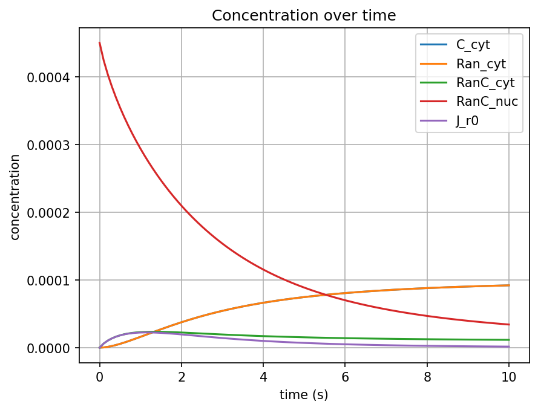
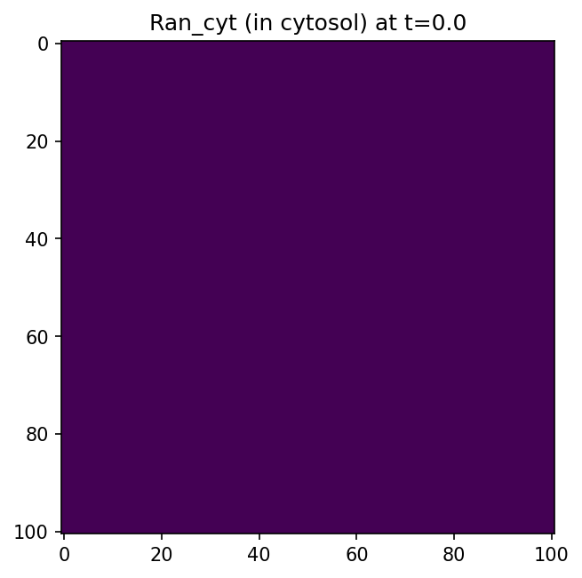
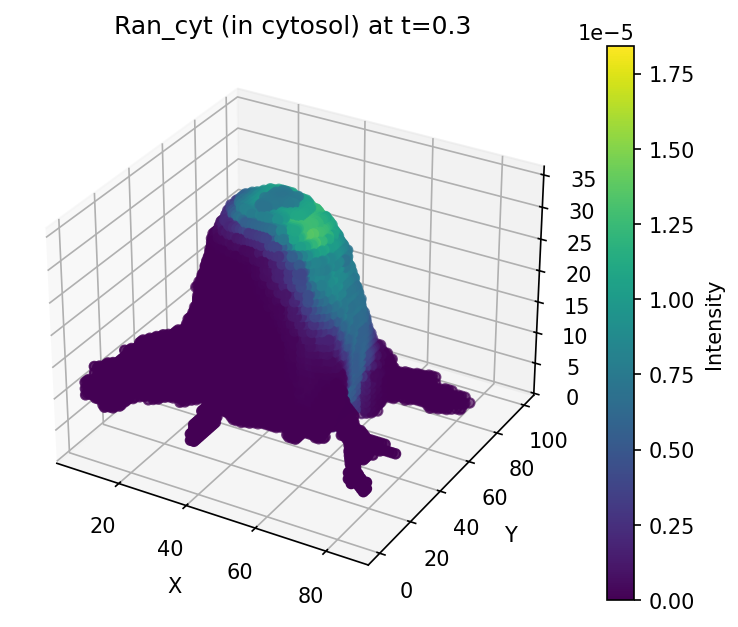

# Visualization & Analysis

This guide covers pyvcell's built-in visualization tools: concentration time series, 2D/3D slices, animations, and interactive Trame widgets.

## Prerequisites

- pyvcell installed (`pip install pyvcell`)
- A simulation result (see [Quick Start](../getting-started/quickstart.md))

## The Plotter API

Every simulation `Result` includes a `plotter` object with methods for common visualizations:

```python
import pyvcell.vcml as vc

biomodel = vc.load_vcml_file("model.vcml")
result = vc.simulate(biomodel, "sim1")

plotter = result.plotter
```

## Concentration time series

Plot mean concentrations of all species over time:

```python
result.plotter.plot_concentrations()
```

This generates a line plot with one curve per species, showing how mean concentration evolves over the simulation duration.



## Plot averages (post-processing)

For post-processing variable statistics:

```python
result.plotter.plot_averages()
```

## 2D slices

View a 2D cross-section of the spatial data at a specific z-index:

```python
result.plotter.plot_slice_2d(
    time_index=0,
    channel_name="s0",
    z_index=5,
)
```

Parameters:

- `time_index` — which saved time point to display
- `channel_name` — the species/variable name
- `z_index` — the z-plane to slice through



## 3D volume slices

Render a 3D orthogonal-slice view of the data:

```python
result.plotter.plot_slice_3d(
    time_index=3,
    channel_id="s1",
)
```



## Animations

### 3D slice animation over time

Create an animation that cycles through time points for a given channel:

```python
anim = result.plotter.animate_channel_3d(channel_id="s0")
```

In Jupyter notebooks, the animation renders inline. In scripts, use Matplotlib's animation saving:

```python
anim.save("s0_animation.gif", writer="pillow")
```

### Image animation

```python
anim = result.plotter.animate_image(channel_index=4)
```

## Accessing raw data

### Channel metadata

```python
# List all channels
print([c.label for c in result.channel_data])

# Get a specific channel
channel = result.plotter.get_channel("s0")
print(channel.min_values)   # min at each time point
print(channel.max_values)   # max at each time point
print(channel.mean_values)  # mean at each time point
```

### Time points

```python
print(result.time_points)
```

### Spatial data as NumPy arrays

```python
# 3D array for a specific channel and time
data = result.get_slice("s0", time_index=3)
print(data.shape)  # e.g., (50, 50, 50)
```

### Zarr dataset

Results are stored as Zarr arrays for efficient access:

```python
zarr_ds = result.zarr_dataset
print(zarr_ds.shape)  # (num_times, num_channels, nz, ny, nx)
```

## VTK data and 3D meshes

For advanced 3D visualization and mesh operations, access the VTK data:

```python
vtk_data = result.vtk_data

# Available methods
vtk_data.get_vtk_grid(time_index=0, var_name="s0")
vtk_data.get_vtu_file(time_index=0, var_name="s0")
vtk_data.write_mesh_animation(var_name="s0", output_dir="mesh_anim/")
```

## Interactive Trame widgets (Jupyter)

For interactive 3D visualization in Jupyter notebooks, use the Trame widget:

```python
from pyvcell.sim_results.widget import App

app = App(vtk_data=result.vtk_data)
await app.run()
```

This launches an interactive 3D viewer in the notebook with controls for time stepping, variable selection, and camera manipulation.

!!! note "Trame requirements"
The Trame widget requires Jupyter with the `trame-jupyter-extension` installed.
This is included in pyvcell's dev dependencies.

## Post-processing statistics

Access variable statistics from the simulation:

```python
post_processing = result.post_processing
for var in post_processing.variables:
    print(f"{var.var_name}: unit={var.stat_var_unit}")
```

## Complete example

```python
import pyvcell.vcml as vc

biomodel = vc.load_vcml_file("model.vcml")
result = vc.simulate(biomodel, "sim1")

# Time series
result.plotter.plot_concentrations()

# Spatial visualization
result.plotter.plot_slice_2d(time_index=0, channel_name="s0", z_index=5)
result.plotter.plot_slice_3d(time_index=3, channel_id="s0")

# Animation
anim = result.plotter.animate_channel_3d(channel_id="s0")

# Raw data
data = result.get_slice("s0", time_index=3)
print(f"Data shape: {data.shape}, min={data.min():.2f}, max={data.max():.2f}")
```

!!! tip "Interactive tutorial"
See the [Visualization tutorial](notebooks/visualization.ipynb) for a runnable notebook with visual output. Also see the [widget notebook](https://github.com/virtualcell/pyvcell/blob/main/examples/notebooks/widget.ipynb) for Trame widget examples, and the [SBML workflow notebook](https://github.com/virtualcell/pyvcell/blob/main/examples/notebooks/sbml_workflow.ipynb) for comprehensive plotting examples.

## Next steps

- [Building a Model](building-a-model.md) — Create models to visualize
- [Parameter Exploration](parameter-exploration.md) — Compare results across parameter values
